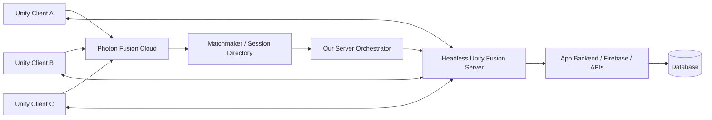
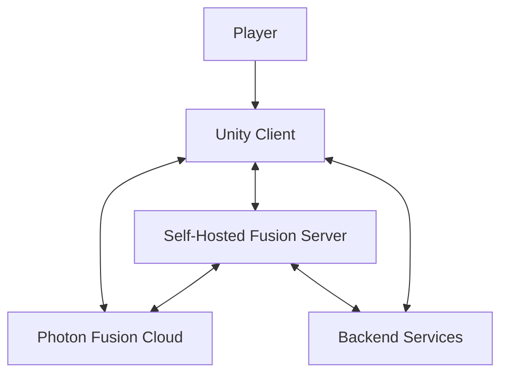
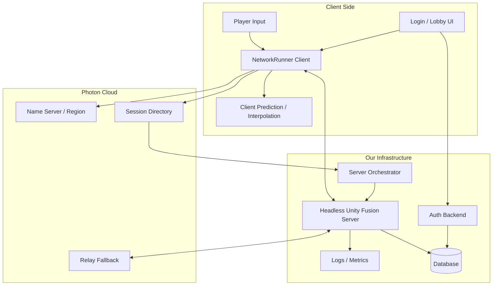
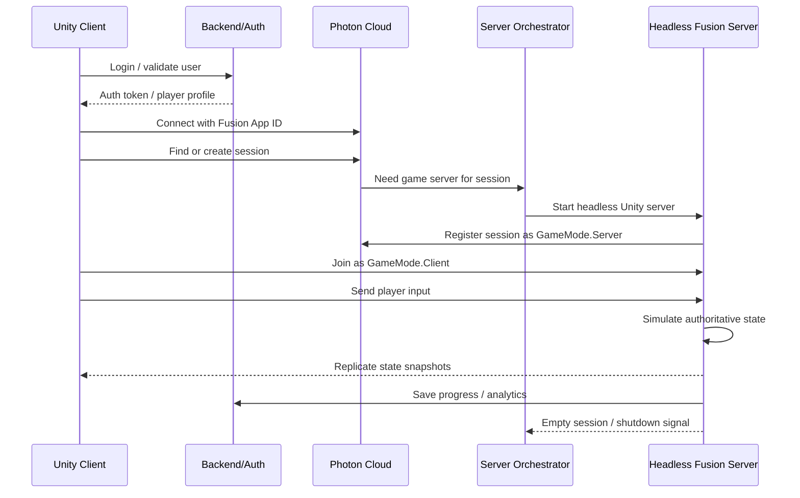

# Photon Fusion Self-Hosted Server Flow

Date: 2026-07-13

This document explains what changes if the project moves from Photon PUN 2 to Photon Fusion 2 and wants to run authoritative game logic on our own dedicated server.

## Short Answer

If we switch to Photon Fusion and want our own server, the correct topology is usually:

```csharp
GameMode.Server
```

That means:

- The Unity game server runs as a headless build on our own VPS, cloud VM, Docker host, or game-server hosting provider.
- Players run normal Unity client builds.
- Photon Fusion handles networking/session connection logic.
- Photon Cloud is still normally used for session services such as connection handling, relay fallback, and server migration support.
- Our own server runs the real gameplay authority: spawning, movement validation, combat, state changes, scene/session rules.

Important: this is not the same as Photon PUN. PUN uses rooms and a MasterClient. Fusion Server Mode uses an authoritative server process with no local player.

## Fusion Modes

| Mode | Who Runs Authority | Server Needed | Use Case |
|---|---|---:|---|
| Shared | Photon cloud room distributes state authority between clients | No custom game server | Casual/co-op/simple worlds, lowest server ops |
| Host | One player is both server and player | No dedicated server, but host player must stay online | Small private sessions, easy testing |
| Server | Headless Unity process has state authority, no player attached | Yes | Authoritative multiplayer, anti-cheat, stable rooms |

For this project, if the requirement is "host on my own server", use **Server Mode**.

## What Photon Cloud Still Does

Even with our own game server, Photon Cloud is still part of the Fusion architecture.

Photon's Fusion dedicated-server documentation describes these involved parts:

- Fusion headless build
- Dedicated game session instance
- Dedicated server machine from a hosting provider
- Photon Cloud with the Fusion Cloud Plugin
- Clients connecting to the dedicated game instance

Photon also notes that a public Photon Cloud subscription is sufficient for normal Fusion Server Mode, while Enterprise Cloud is only needed for dedicated Photon Cloud servers or enterprise-only features.

Sources:

- https://doc.photonengine.com/fusion/v2/concepts-and-patterns/dedicated-server-overview
- https://doc.photonengine.com/fusion/v2/fusion-intro
- https://www.photonengine.com/fusion/pricing

## Subscription / Hosting Needs

### Required

1. Photon Fusion App ID
   - Create a Fusion app in Photon Dashboard.
   - Put the Fusion App ID into Unity Fusion settings.

2. Photon Cloud plan
   - Development can start free.
   - Public Cloud is enough for normal dedicated game server topology.
   - Paid plan is needed when CCU/traffic exceeds free tier.

3. Our own game-server hosting
   - VPS, bare metal, Docker host, Kubernetes, AWS, Azure, GCP, PlayFab, GameLift, Edgegap, Hathora, Gameye, Multiplay, etc.
   - This cost is separate from Photon subscription.

### Photon Pricing Snapshot

As of 2026-07-13 from Photon Fusion pricing:

| Plan | Cost | Included CCU | Notes |
|---|---:|---:|---|
| Development | Free | 20 CCU | Development only, capped |
| Free launch app | Free | 100 CCU | One app per customer, games only |
| 100 CCU | $95 one-time / 12 months | 100 CCU | Games only |
| 500 CCU | $125/month | 500 CCU | Includes traffic, CCU burst |
| 1000 CCU | $250/month | 1000 CCU | Includes traffic, CCU burst |
| 2000 CCU | $500/month | 2000 CCU | Includes traffic, CCU burst |
| Premium Cloud | $1000/month minimum | 2000+ CCU | Usage-based scaling |
| Enterprise Cloud | Contact Photon | Custom | SLA, dedicated Photon cloud servers, enterprise services |

Photon plan cost covers Photon Cloud usage, not our Unity game server CPU/RAM cost.

## Recommended Architecture



## High-Level Flow

1. Player opens game.
2. Client authenticates with our app backend/Firebase.
3. Client connects to Photon Fusion using Fusion App ID.
4. Client requests a session:
   - join existing room/session, or
   - create new session.
5. Matchmaking/session logic decides where the player should go.
6. Our orchestrator starts or selects a headless Unity server.
7. Headless server starts Fusion with `GameMode.Server`.
8. Clients join the session as `GameMode.Client`.
9. Server owns state authority.
10. Clients send input.
11. Server simulates world state.
12. Fusion replicates state back to clients.
13. When empty, server process shuts down or returns to pool.

## DFD Level 0



## DFD Level 1



## Runtime Sequence



## Authority Logic

In Server Mode:

- Server has `StateAuthority`.
- Clients usually have `InputAuthority` over their own player object.
- Client does not decide final world state.
- Client sends input only.
- Server validates and applies input.
- Server spawns/despawns networked objects.
- Server changes health, inventory, score, position correction, scene/session state.

Example responsibility split:

| Feature | Client | Server |
|---|---|---|
| Read keyboard/mobile input | Yes | No |
| Predict local movement | Yes | Optional |
| Validate movement | No | Yes |
| Spawn player | No | Yes |
| Assign seat/class/team | Request only | Yes |
| Chat message submit | Yes | Validate/filter/relay |
| Save progress | Request only | Yes/backend |
| Scene/session state | Display only | Yes |

## Server Build Flow

1. Add Fusion package.
2. Create Fusion App ID in Photon Dashboard.
3. Configure Fusion settings in Unity.
4. Replace PUN room flow with Fusion `NetworkRunner`.
5. Create a server startup path:
   - command-line args for region/session name/port/build id
   - `StartGameArgs`
   - `GameMode.Server`
6. Create a client startup path:
   - login
   - matchmaking/session selection
   - `GameMode.Client`
7. Build Linux headless server.
8. Deploy server build to hosting.
9. Add process orchestration:
   - start server when session needed
   - health check
   - logs
   - shutdown when empty
10. Test with multiple clients.

## Minimal StartGame Model

This is only conceptual pseudocode, not drop-in code:

```csharp
// Dedicated server process
runner.StartGame(new StartGameArgs
{
    GameMode = GameMode.Server,
    SessionName = sessionName,
    Scene = targetScene,
});

// Player client
runner.StartGame(new StartGameArgs
{
    GameMode = GameMode.Client,
    SessionName = sessionName,
    Scene = targetScene,
});
```

For local development, use Host Mode first because it is easier to test:

```csharp
GameMode.Host
```

Then move the same gameplay authority model to:

```csharp
GameMode.Server
```

## Migration From Current PUN Project

Current project uses:

- `PhotonNetwork.ConnectUsingSettings()`
- `PhotonNetwork.JoinLobby()`
- `PhotonNetwork.JoinRandomRoom()`
- `PhotonNetwork.CreateRoom()`
- `PhotonNetwork.Instantiate()`
- `PhotonView`
- `PunRPC`
- `PhotonNetwork.IsMasterClient`

Fusion replacements are architectural, not one-line swaps:

| Current PUN Concept | Fusion Direction |
|---|---|
| `PhotonView` | `NetworkObject` |
| `MonoBehaviourPunCallbacks` | Fusion callbacks / `INetworkRunnerCallbacks` |
| `PhotonNetwork.Instantiate` | `Runner.Spawn` |
| `PunRPC` | Fusion RPCs |
| MasterClient authority | Server `StateAuthority` |
| Join random room | Session search / matchmaking / `StartGameArgs` |
| PUN ownership | Fusion StateAuthority/InputAuthority |

## Recommended Migration Plan

### Phase 1: Prototype

- Create a small separate Fusion test scene.
- Do not migrate the whole university world immediately.
- Implement only:
  - connect
  - spawn player
  - move player
  - sync name/avatar id
  - join/leave session

### Phase 2: Authority Model

- Decide what server owns:
  - player spawn
  - teleport
  - scene changes
  - seating
  - chat visibility
  - avatar state
  - room/session membership

### Phase 3: Headless Build

- Build Linux headless server.
- Run locally first.
- Run on one VPS next.
- Add logs and graceful shutdown.

### Phase 4: Orchestration

- Add session allocation.
- Add health checks.
- Add automatic restart.
- Add server capacity limits.
- Add region selection.

### Phase 5: Full Migration

- Replace PUN player prefab with Fusion network prefab.
- Replace PUN chat/session hooks.
- Replace MasterClient logic.
- Remove PUN dependency only after all runtime scenes are migrated.

## Hosting Options

### Simple VPS

Good for prototype.

- One Linux VM.
- Run one or more headless Unity server processes.
- Cheapest and easiest to understand.
- Manual scaling.

### Docker on VPS

Good next step.

- Package server as Docker image.
- Start one container per game session.
- Easier deployment and cleanup.

### Game Server Provider

Best for production.

- Edgegap, Hathora, Gameye, PlayFab, GameLift, Multiplay, etc.
- Handles allocation, regions, autoscaling, health checks.
- Higher cost but less custom DevOps.

## Cloud Cost Model

Total cost has two parts:

```text
Total multiplayer cost =
    Photon Cloud subscription / CCU / traffic
  + Our dedicated game server compute
  + Backend/database/storage/logging
```

Photon Cloud does not remove the need to pay for our own server CPU/RAM if we choose Server Mode.

## Production Checklist

- Fusion App ID created.
- Photon plan selected for expected CCU.
- Server build is Linux headless.
- Server process accepts session args.
- Server logs to file/stdout.
- Server has health endpoint or heartbeat.
- Orchestrator can start/stop sessions.
- Client can recover from disconnect.
- Empty sessions shut down.
- Region strategy is defined.
- Backend auth token is validated by server.
- Cheat-sensitive logic runs server-side.
- Load test with expected CCU.

## Decision

For Setterlun University-style persistent social multiplayer:

- Use **Fusion Host Mode** for local early testing.
- Use **Fusion Server Mode** for production if we need authoritative state and our own hosted server.
- Avoid Shared Mode if server-side authority, anti-cheat, or reliable long-running world control is required.

